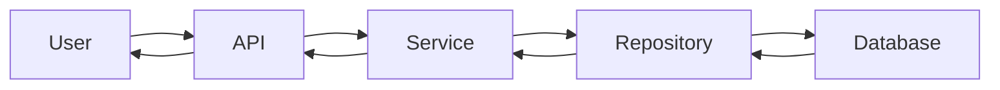
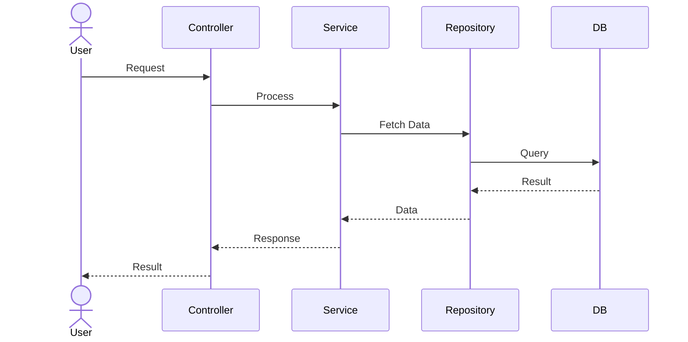
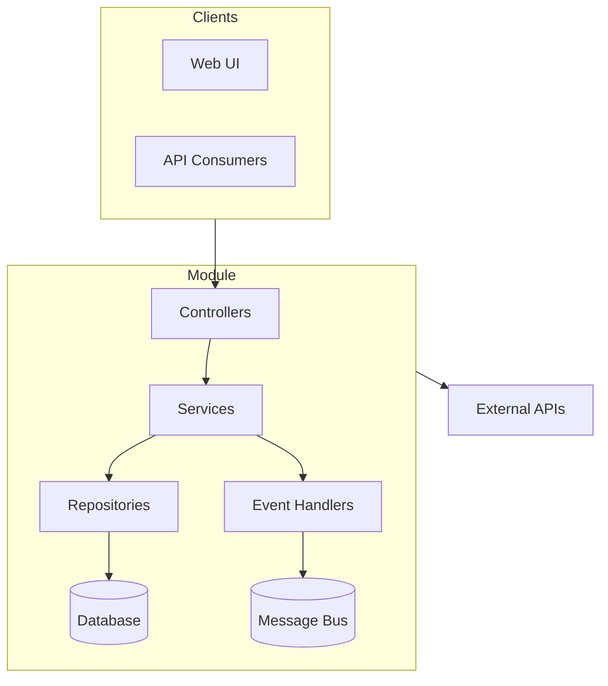

# Architectural Analysis

You are acting as a **Senior Software Architect and Principal Engineer**. Perform a COMPLETE ARCHITECTURAL ANALYSIS of the target module/project directory.

## Input

Target path: `$ARGUMENTS` (if empty, use the current working directory / opened workspace root).

If the target is ambiguous (e.g., a solution with many modules), ask the user with `AskUserQuestion` which module to analyze.

## Operating Principles

1. **Read the entire module recursively** — do not stop at top-level files.
2. **Follow actual code paths**, not naming assumptions.
3. **Cite specific files, classes, and line numbers** as evidence.
4. **Prefer evidence from code over conventions.**
5. **Highlight unknowns** explicitly where code is insufficient.
6. **Be exhaustive** — assume senior architects will review this document.
7. **Do NOT modify code.** This is a read-only audit.
8. **Generate Mermaid diagrams** wherever they aid understanding.

## Process

### Phase 1 — Discovery (parallelize where possible)

Run these in parallel:
- List the full directory tree (respect `.gitignore`, ignore `node_modules`, `bin`, `obj`, `dist`).
- Read root manifests: `*.csproj`, `*.sln`, `package.json`, `tsconfig.json`, `appsettings*.json`, `web.config`, `Dockerfile`, `docker-compose*.yml`, `*.yaml`, `Startup.cs`, `Program.cs`, `Global.asax*`, `Module.cs`, `*.module.ts`, `pom.xml`, `build.gradle`, `pyproject.toml`, `requirements.txt`, `go.mod`, `Cargo.toml`.
- Identify the primary language(s), framework(s), and target runtime.
- Inventory: controllers, services, repositories, DTOs, domain entities, event handlers, message consumers, scheduled jobs, migrations, configuration files, tests.

### Phase 2 — Deep Analysis

For each major component:
- Read the file(s) end-to-end.
- Trace constructor dependencies, DI registrations, and call graphs.
- Identify business rules embedded in code (validation, invariants, calculations).
- Map persistence: NHibernate mappings, EF DbContext, raw SQL, stored procedures, views, migrations.
- Map messaging: Rebus handlers, Kafka/RabbitMQ/Azure Service Bus consumers and publishers, scheduled jobs (Quartz, Hangfire, cron).
- Map integrations: HTTP clients, SDK usage, third-party APIs.
- Map security: `[Authorize]`, permission checks, multi-tenancy filters, secret handling.

Use the `Explore` subagent in parallel for large modules (split by folder or layer) to keep the main context clean.

### Phase 3 — Synthesis

Produce the full document in the format below. Do not skip sections; if a section is not applicable, state **"Not applicable — <reason>"** with evidence.

---

# OUTPUT FORMAT (use this exact structure)

## 1. Module Overview
- **Module Name:**
- **Purpose of the Module:**
- **Business Problem Solved:**
- **Key Responsibilities:** (bulleted)
- **High-Level Summary:** (2–4 paragraphs)

## 2. Architecture Overview
- **Architectural Pattern(s) used:** (Layered / Clean / DDD / CQRS / Event-Driven / Microservice / Modular Monolith / Other — justify from code evidence)
- **Fit within the overall ecosystem (e.g., XENA):** how it interacts with other modules/services.

## 3. Directory Structure Analysis
Generate a tree view (truncate noisy folders) and explain the responsibility of each folder.

```
/Module
├── Controllers
├── Services
├── Repositories
├── DTOs
├── Domain
├── Infrastructure
└── ...
```

## 4. Component Breakdown
For **every important component**, provide:

### `<ComponentName>` — `path/to/File.cs`
- **Purpose:**
- **Dependencies:** (constructor-injected and static)
- **Used By:** (callers)
- **Important Methods:** (signatures + 1-line behavior)
- **Business Rules:**
- **Potential Risks:**

## 5. Request Flow Analysis
Trace complete execution paths step-by-step (one per major use case):

```
User Request
→ Controller (FooController.Post)
→ Validator (FooRequestValidator)
→ Service (FooService.Handle)
→ Repository (FooRepository.Save)
→ Database (Foo table)
→ Response (FooDto)
```

## 6. Data Flow Diagram

Use **actual project component names**.

## 7. Sequence Diagrams
Generate sequence diagrams for each major use case:



## 8. Dependency Analysis
- **Internal dependencies** (project references)
- **External libraries** (NuGet / npm / etc. — with versions)
- **Shared components** (Xena.Common, Xena.Infrastructure, etc.)
- **Cross-module dependencies**

Explain **why** each exists.

## 9. Database Interaction Analysis
- Tables used
- Entities & NHibernate/EF mappings
- Repositories & Query objects
- Stored procedures / Views
- Migrations
- Multi-tenancy filters

Provide an ER-style description (Mermaid `erDiagram` when relationships are clear).

## 10. Business Logic Analysis
- Core business rules (with file:line citations)
- Validation rules
- Compliance requirements (GDPR, SOX, audit, etc.)
- Domain-specific logic

Explain the **reasoning** behind each rule.

## 11. Integration Analysis
- External APIs
- Internal services
- Message brokers (Rebus, Kafka, RabbitMQ, Azure Service Bus)
- Cloud services (Azure, AWS)
- Third-party systems

Document request/response payload shapes and error contracts.

## 12. Configuration Analysis
- `appsettings*.json` keys and consumers
- Environment variables
- Feature flags
- DI registrations (with lifetime: Singleton/Scoped/Transient)
- Startup/bootstrapping order

Explain the **impact** of each setting.

## 13. Error Handling Strategy
- Exception handling (global filters, middleware, try/catch patterns)
- Retry mechanisms (Polly, Rebus retries, etc.)
- Logging (Serilog, NLog, ILogger)
- Monitoring (App Insights, Prometheus, etc.)
- Audit logging

Identify **gaps**.

## 14. Security Analysis
- Authentication mechanism
- Authorization & permission checks
- Multi-tenancy isolation
- Data protection (encryption at rest / in transit)
- Secret handling (Key Vault, env vars, hardcoded?)
- Input validation & injection risks (SQL, XSS, SSRF)

Highlight **OWASP-Top-10-relevant concerns**.

## 15. End-to-End Architecture Diagram
Comprehensive Mermaid diagram of the full module:



## 16. Developer Walkthrough
> *"If a new developer joins tomorrow, how does this module work?"*

Provide a narrative, step-by-step walkthrough from entry point to completion, naming the actual files they would open in order.

## 17. Technical Debt & Improvement Opportunities
- Code smells (with examples)
- Tight coupling
- Large classes / God objects
- Duplicated logic
- Missing abstractions
- Performance bottlenecks (N+1 queries, sync-over-async, etc.)
- Scalability concerns

Provide **prioritized, actionable recommendations**.

## 18. Executive Summary
- **Purpose**
- **Key Components**
- **Major Flows**
- **Critical Dependencies**
- **Risks**
- **Recommendations**

---

## Module Architecture Scorecard

| Dimension       | Score (1–10) | Justification |
|-----------------|--------------|---------------|
| Maintainability |              |               |
| Scalability     |              |               |
| Testability     |              |               |
| Security        |              |               |
| Performance     |              |               |
| Complexity      |              | (lower = simpler; explain) |

Provide a final 2–3 sentence verdict on production readiness.

---

## Output Delivery

1. Render the full document in the chat as Markdown.
2. Additionally, save the report to `./architecture-analysis-<module-name>-<yyyyMMdd>.md` in the workspace root using the `Write` tool, so it can be shared or committed to docs.
3. If the user prefers chat-only output, skip the file write.

## Quality Bar

Before finishing, self-check:
- [ ] Every section present (or explicitly marked "Not applicable").
- [ ] At least 3 Mermaid diagrams (data flow, sequence, end-to-end).
- [ ] Concrete file/class citations throughout — no hand-waving.
- [ ] Scorecard completed with justification.
- [ ] No code modifications were made.
