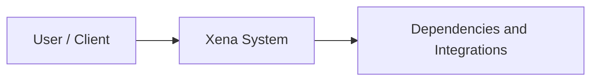

# TDD and JIRA Implementation Workflow

Create the required Technical Design Document (TDD) for a JIRA ticket, preserve the TDD template structure, then perform the complete `review-jira` analysis and implementation workflow. The TDD and implementation plan are separate deliverables: do not omit either one.

## Input

JIRA ticket URL or key: $ARGUMENTS

## Non-Negotiable Requirements

- Preserve every section required by the TDD template. Do not replace the template with a shorter summary.
- Use facts from the JIRA ticket, comments, linked tickets, attachments, and codebase analysis. Mark unknowns as open questions; never invent details.
- Complete the TDD before implementation begins.
- Complete the full JIRA analysis and implementation plan before implementation begins.
- Enter plan mode before presenting the implementation plan.
- Save the complete approved TDD and review findings to a Markdown file on the Desktop before asking to implement.
- Do not implement, commit, or push until the user explicitly approves the implementation after the Desktop file has been saved.
- Keep the TDD and implementation plan distinct even when information overlaps.
- Never manually edit `*.verified.json` snapshots; let Verify regenerate them.
- Search for reusable resource strings before adding new ones.
- Use the MCP JIRA tools; do not fall back to WebFetch.
- If the JIRA MCP server is disconnected, tell the user immediately and stop.

## Phase 1: Extract the Ticket Key

Parse the ticket key from the input. It may be provided as:
- A full URL such as `https://jira.eg.dk/browse/XNA-18827` -> extract `XNA-18827`
- A key such as `XNA-18827`

If the input is empty, ask the user with `AskUserQuestion`.

## Phase 2: Fetch Complete JIRA Context

Use `mcp__mcp-jira-service__jira_get_issue` to retrieve:
- Summary, description, and acceptance criteria
- Issue type, priority, status
- Labels, components, and fix version
- Linked issues, including parent epic, blockers, and related tickets
- All comments for team decisions and clarifications
- Attachments; download them when they contain specifications, mockups, or diagrams

If the ticket references other JIRA tickets in its description, comments, or links, fetch those tickets too.

## Phase 3: Explore the Codebase

Systematically explore the Xena codebase using the ticket context. Determine the affected business domain and inspect:

### Domain
- Entities and business rules in `src/Xena.Domain/`
- Related DTOs and contracts in `src/Xena.Contracts/Domain/`
- NHibernate mappings in `src/Xena.Infrastructure.Mappings/Entities/`
- Relevant multi-tenancy filters in `src/Xena.Infrastructure.Mappings/Filters/`

### Infrastructure
- Database commands and queries in `src/Xena.Infrastructure.Database/`
- The latest migration in `src/Xena.DBMigration/MigrationSteps/`
- Existing patterns and the next sequential migration number

### API
- Controllers and routes in `src/Xena.Web.Api/Controllers/`
- Message handlers in `src/Xena.Web.Api/` when asynchronous processing is involved

### Frontend
- Razor views in `src/Xena.Web/Views/`
- TypeScript and JavaScript in `src/Xena.Web/Scripts/`
- Styles in `src/Xena.Web/Content/css/`

### Services
- Service messages in `src/Xena.ServiceMessages.*`
- Corresponding handlers in `src/Xena.Services.*`

### Tests
- Integration tests in `src/Xena.IntegrationTests/`
- Unit and domain tests in `src/Xena.UnitTests/` and `src/Xena.Domain.Tests/`
- Service-specific test projects
- Related Verify snapshots in `VerifyFiles/`

### Resources
- Existing reusable strings in `src/Xena.Resources/`
- Email resources in `src/Xena.Resources.Email/` when relevant

Read every identified file sufficiently to understand local patterns, similar functionality, dependencies, and existing test coverage. Use the `Explore` subagent for deeper research when the ticket spans many areas.

## Phase 4: Create the TDD

Create a TDD draft using the following template structure. Every section must be present, even when the correct value is `Not applicable`, `None identified`, or `Open question`.

# TDD Template

## Table of Contents

1. Document Revision History
2. Initiative/Epic Overview
   - Problem Description
   - Context or Background
   - Assumptions
   - Dependencies
   - Risks/Constraints
3. Solution
   - Current or Existing Solution / Design (if applicable)
   - High-Level Design
   - Solution Context Diagram
   - Solution Description
4. Considered Alternative Solutions

## Document Revision History

Version every update using the `#.0` stage-submission convention. For example, `0.9` is an update and `1.0` is the version created as part of the initiative. Provide detailed change descriptions for every version.

| Date | Version | Revision Scope and Description |
|---|---|---|
| {date} | 0.1 | Initial TDD draft created from JIRA ticket and codebase analysis |

## 1. Initiative/Epic Overview

### Problem Description

Provide the summary of the problem from the user or business perspective, including context, suggested solution, and stakeholders.

### Context or Background

Explain the existing behavior, business context, relevant history, and why the ticket is needed now.

### Assumptions

List assumptions made from the ticket, comments, linked issues, attachments, and codebase evidence. Separate confirmed facts from assumptions.

### Dependencies

List technical, product, JIRA, service, database, deployment, and team dependencies.

### Risks/Constraints

List known risks and constraints, including multi-tenancy, compatibility, performance, security, data migration, rollout, and operational concerns.

## 2. Solution

### Current or Existing Solution / Design

Describe the current implementation and relevant existing design. If none exists, explicitly state that.

### High-Level Design

Describe the proposed design, affected layers, data flow, integrations, persistence changes, and user-facing behavior.

### Solution Context Diagram

Include a Mermaid context diagram when the ticket involves multiple components or boundaries. Use quoted labels for special characters, `<br/>` instead of `\\n` in labels, and blank lines around the Mermaid block. If a diagram is not meaningful, state why.



### Solution Description

Describe the proposed solution in enough technical detail for implementation. Reference actual code paths and patterns found during exploration. Cover domain, contracts, mappings, database, migrations, API, frontend, services, resources, and tests as applicable.

## 3. Considered Alternative Solutions

Describe significant alternatives and why they were rejected in favor of the proposed solution. Include tradeoffs, constraints, and evidence for the decision.

## TDD Review Gate

Present the complete TDD draft to the user and ask for explicit approval or corrections. Do not proceed to implementation based on an implicit approval. Incorporate requested corrections and show the revised TDD until the user approves it.

The TDD approval does not replace implementation-plan approval. Both approvals are required.

## Phase 5: Full Review-JIRA Analysis and Plan

After the TDD is approved, perform the complete `review-jira` analysis below. Preserve this phase even if the TDD already contains similar information.

### Ticket Summary

Present:
- Ticket key and summary
- Issue type, priority, and status
- Parent epic, if any

### Analysis

Explain in your own words what the ticket requests. Extract the acceptance criteria. Explain how similar functionality is implemented and reference specific files.

### Affected Areas

Organize findings by layer:
- Domain: entities to create or modify and validation rules
- Contracts: DTOs to create or modify
- Mappings: NHibernate mappings and filters
- Database: commands, queries, and creators/updaters/deleters
- Migrations: schema changes, tables, columns, indexes, and foreign keys
- API: controllers, routes, and handlers
- Frontend: views, viewmodels, styles, and scripts
- Services: service messages and handlers
- Resources: new or reused resource strings
- Tests: tests to add or update and Verify snapshots that will change

### Implementation Steps

Provide a numbered, dependency-ordered list of concrete steps referencing specific files. Follow Domain -> Contracts -> Mappings -> Infrastructure.Database -> API -> Frontend. Include the next sequential migration number, test updates, snapshot regeneration, and any required service or resource changes.

### Risks and Considerations

Address:
- FiscalSetup and multi-tenancy scoping
- Side effects on existing calculations or denormalized data
- Rebus service message changes
- Elasticsearch reindexing
- Open questions requiring team clarification
- Dependencies on other tickets

### Estimated Scope

List files to create, modify, or delete. Classify the effort as small (1-5 files), medium (5-15 files), or large (15+ files).

## Implementation Plan Approval Gate

Enter plan mode with `EnterPlanMode` before presenting the implementation plan. Present the plan in the structure above, then use `ExitPlanMode` to request approval.

Do not begin implementation after plan approval yet. First continue to Phase 6 and save the complete findings document.

## Phase 6: Save the Final Findings Document

After the user approves the implementation plan, assemble one complete Markdown document containing all of the following:

1. The approved TDD, including every section from the TDD template and any approved corrections.
2. The complete `review-jira` findings, including ticket summary, analysis, acceptance criteria, affected areas, implementation steps, risks and considerations, open questions, dependencies, and estimated scope.
3. The approved implementation plan exactly as presented to the user.
4. A generation date, ticket key, and branch/base-branch information.

Do not shorten, replace, or summarize any of these sections in the saved file. Preserve Mermaid diagrams, tables, headings, lists, code paths, file references, assumptions, risks, alternatives, and open questions. The Desktop file is the final findings record and must contain all findings from both phases.

Use the `Write` tool to save it to:

```text
~/Desktop/{TICKET_KEY}_TDD_Review_Findings.md
```

After the write succeeds, tell the user the exact filename and confirm that the complete TDD and review findings were saved. If the write fails, report the error and do not ask for implementation approval.

## Code Change Approval Gate

After the final findings file is successfully saved, ask the user explicitly:

> "The complete TDD and review findings are saved to `~/Desktop/{TICKET_KEY}_TDD_Review_Findings.md`. Do you approve making the code changes described in the implementation plan? Please answer yes or no."

Wait for an explicit yes/approval. A saved document or approval of the review plan alone is not approval to modify code. If the user says no, requests changes, or does not clearly approve, do not edit code; address the requested documentation or plan changes first, save the revised complete findings file again, and ask for code-change approval again.

## Phase 7: Implement the Approved Solution

Only after the user explicitly approves the code changes after the Desktop save:

1. Implement in dependency order, Domain first and Frontend last.
2. After each significant step, summarize what was done.
3. Use Xena mapping extension methods such as `AddEntityMapping()` and `AddFiscalMapping()`.
4. Use the next sequential migration number.
5. Follow Knockout observable patterns for frontend changes.
6. Search for reusable resource strings before adding any new string.
7. Run relevant tests when applicable.
8. Never manually edit Verify snapshot files; regenerate them through the Verify framework.

After implementation, summarize all changes and ask whether the user wants to run tests, use `/ship` to commit/create a PR, use `/worklog` to log time, or update the JIRA ticket with a comment.

## Final Deliverables

The completed workflow must leave the user with:

1. An approved TDD containing every template section.
2. A separate approved implementation plan containing the complete `review-jira` analysis.
3. A Desktop Markdown file containing the complete approved TDD and review findings.
4. The implemented ticket changes, only after explicit code-change approval following the Desktop save.
5. Test results or a clear statement of what could not be run.
6. No commit or push unless separately approved.

## Base Branch

Use `development` as the base branch, never `master` or `main`.
